# ABIChallenge_DavidVillate

## 1. Architecture

En un ecosistema empresarial moderno, la implementación y consumo eficiente de modelos analíticos requiere una arquitectura robusta que permita el manejo y procesamiento adecuado de datos desde diversas fuentes, garantizando la gobernanza y accesibilidad de los modelos desplegados para diferentes aplicaciones y usuarios finales. En esta arquitectura, Azure Data Factory (ADF) se encarga de la ingesta y orquestación de los datos, mientras que Databricks se posiciona como la plataforma central para el procesamiento y despliegue de modelos de machine learning, apoyado por Unity Catalog para la gestión de datos y seguridad.

    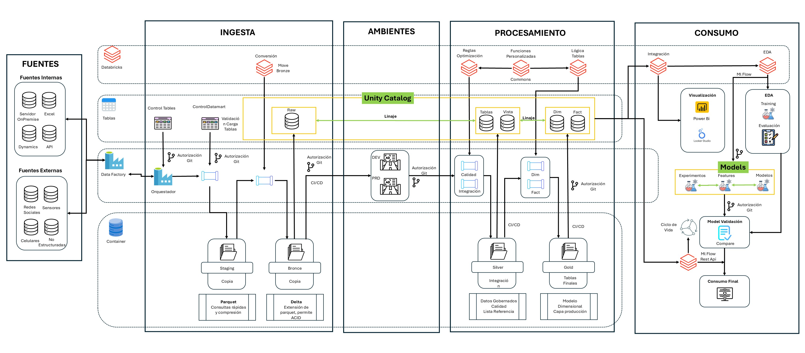

### Flujo de Trabajo
- Fuentes de Datos Externas e Internas: La arquitectura comienza con la ingesta de datos desde múltiples fuentes, tanto internas como externas. Estas fuentes incluyen bases de datos on-premises, archivos Excel, APIs, redes sociales, y sensores IoT, entre otras. Estos datos son gestionados y transferidos mediante Azure Data Factory, que actúa como el motor de integración y orquestación.

- Ingesta y Almacenamiento: Los datos ingresados se transforman y almacenan en formatos Parquet o Delta dentro de un lago de datos. El uso de Parquet permite consultas rápidas y eficientes gracias a su compresión por columnas, mientras que Delta añade capacidades de transacciones ACID, garantizando confiabilidad en el manejo de datos que se actualizan constantemente.

- Procesamiento en Databricks: Databricks se utiliza para procesar los datos mediante pipelines de transformación, integrando reglas de negocio y optimización de consultas. Los datos se gestionan a través de diferentes capas (Bronce, Silver, Gold) que corresponden a la calidad y transformación de los datos:

    - Bronce: Datos crudos.
    - Silver: Datos integrados y gobernados.
    - Gold: Datos listos para el consumo analítico y modelos finales.
    
    Además, Databricks se apoya en Unity Catalog, que asegura la gobernanza y seguridad de  los datos, facilitando el control de acceso y linaje de los datos.

- Despliegue de Modelos con Databricks: La plataforma de MLflow integrada en Databricks permite gestionar el ciclo de vida completo de los modelos analíticos, desde su entrenamiento y experimentación hasta su validación y despliegue. Los modelos pueden ser expuestos mediante APIs REST para su consumo por aplicaciones externas, asegurando que las predicciones se realicen en tiempo real. Unity Catalog asegura que los datos utilizados en los modelos sean consistentes y estén debidamente gobernados, garantizando la seguridad y el linaje de los modelos desplegados.

- Consumo Final: Las aplicaciones de negocio y los sistemas de visualización como Power BI o Looker Studio se integran con los modelos para consumir las predicciones, permitiendo que los usuarios tomen decisiones basadas en datos actualizados y procesados eficientemente.

Esta arquitectura asegura una solución escalable y segura para el procesamiento, modelado y consumo de datos en tiempo real, permitiendo a las organizaciones optimizar sus flujos de trabajo analíticos y lograr un acceso confiable a modelos predictivos que impacten el negocio.

## 2. Collaboration

Este proyecto sigue una estructura de ramas y tags para facilitar el desarrollo y la trazabilidad de versiones.

**Arquitectura Objetivo**

    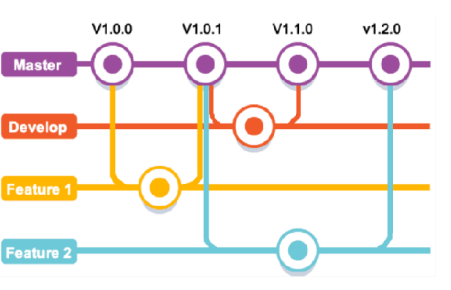

1. **Inicialización de la Rama Principal**
   - La rama principal fue renombrada de `main` a `master` para alinear con convenciones.
   - Se creó el primer tag, `v1.0.1`, en la rama `master` después de cargar un archivo en la nueva rama `feature-1`. Luego, `feature-1` fue mergeado con `master` bajo el tag `v1.0.1`.

    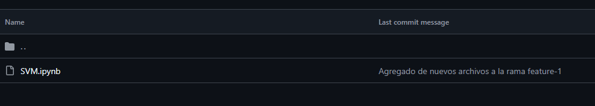

2. **Creación de Ramas Secundarias**
   - Se generaron dos nuevas ramas, `develop` y `feature-2`, para organizar el desarrollo de nuevas funcionalidades.

3. **Error en el Tag `v1.2.0`**
   - Por error, se creó el tag `v1.2.0`. Aunque no tiene cambios significativos, se mantiene para asegurar la trazabilidad en la historia de versiones.

4. **Actualización en `develop` y Tag `v1.1.0`**
   - Se cargó un archivo en `develop` y, tras la revisión, se mergeó con `master` usando el tag `v1.1.0`.

    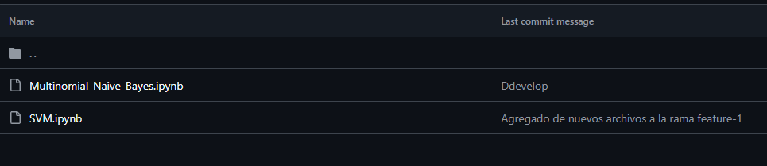

5. **Conflictos en `feature-2` y Resolución con Tag `v1.2.1`**
   - Durante el trabajo en `feature-2`, surgieron conflictos al intentar integrarlo con `master`. Se resolvieron estos conflictos y se realizó un merge en `feature-2` con el tag `v1.2.1` para reflejar la solución.

    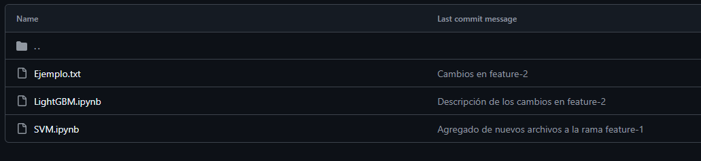

6. **Finalización del Merge de `feature-2` a `master` con Tag `v1.2.2`**
   - Finalmente, tras resolver todos los conflictos, `feature-2` fue mergeada con `master` y consolidada bajo el tag `v1.2.2`, asegurando la integración estable de las nuevas funcionalidades.

    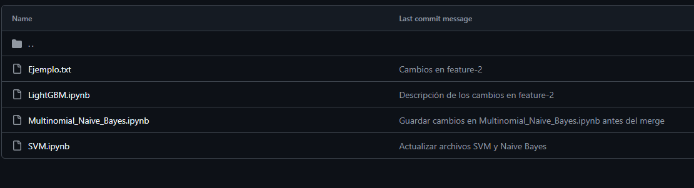

**Arquitectura Lograda**

    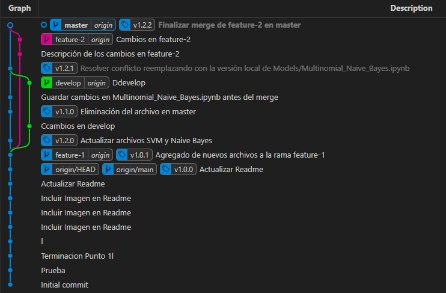

## 3. Automation

SonarCloud es una plataforma en la nube que proporciona análisis estático de código para asegurar la calidad y seguridad en proyectos de software.

- Evalúa el código en busca de errores, bugs, y vulnerabilidades, proporcionando un reporte detallado de problemas potenciales.

- Detecta problemas en tiempo de ejecución y previene futuros problemas al señalar código de baja calidad o con riesgos de seguridad.

- Se integra fácilmente con plataformas de CI/CD como GitHub Actions

Se procede a realizar la integracion, SonarCloud solo permite analizar los repositorios publicos, por lo cual se procede a realizar el cambio de temporal de la visibilidad del repositorio.

Se crean los Token de GitHub y de Sonar, con el fin de realizar el proceso. Y se integran con el codigo correspondiente

    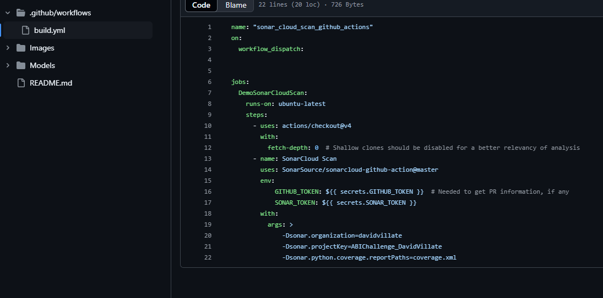

Se corre el proceso mediante Actions

    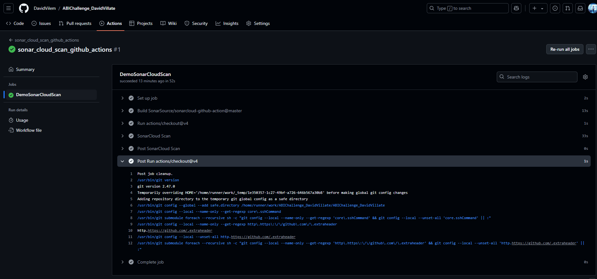

Nos arroja el resultado en SonarCloud, asi como las recomendaciones correspondientes.

    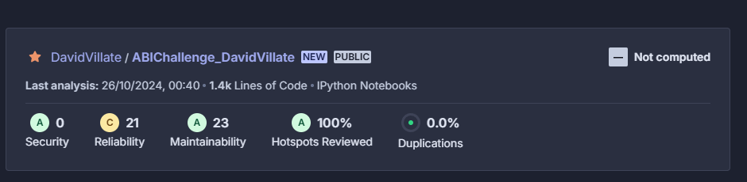

    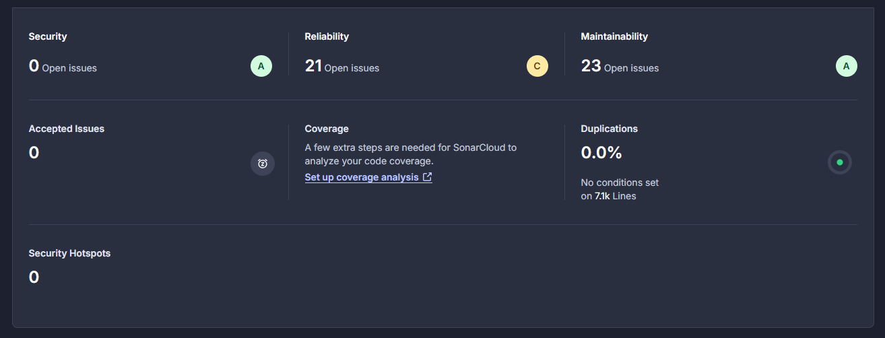

Al Analizarlas en detalles, vemos que la mayoria se refieren a mantenimiento

    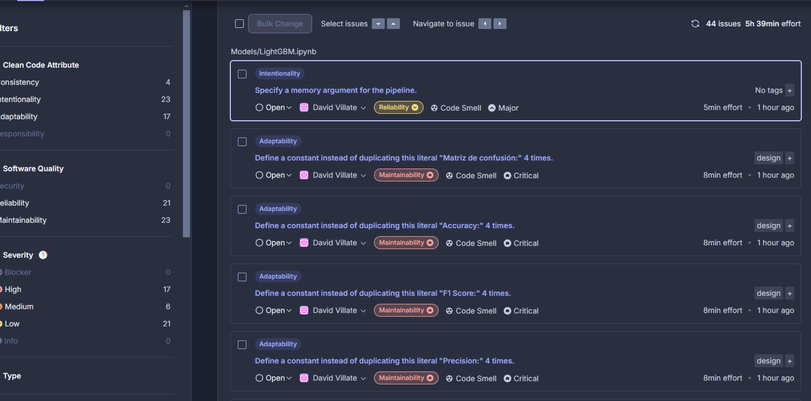

